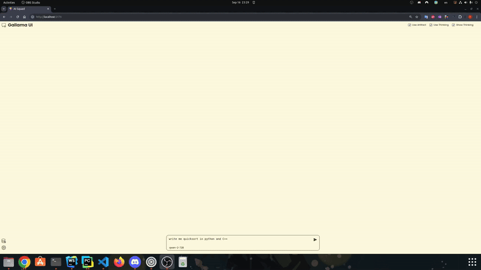

# Gallama UI

Gallama UI is a companion frontend for [gallama](https://github.com/remichu-ai/gallama). It doesn't aim to replace existing frontend libraries but instead provides a UI to interact with unique features that gallama offers, such as thinking and artifacts.

**Note:** Gallama UI is still a work in progress. Feel free to report any bugs you encounter.



## Features

1. Support for the "thinking" feature, where users can define chain-of-thought thinking in XML format
2. Support for the Artifact feature
3. Interaction with Gallama backend for model loading/unloading
4. Customization of model loading with options such as:
   - GPU split
   - Tensor parallel
   - Draft model for speculative decoding

## Installation

### Prerequisites

1. Install gallama by following the instructions in the [gallama repository](https://github.com/remichu-ai/gallama).
2. Install [Node.js](https://nodejs.org/en/learn/getting-started/how-to-install-nodejs) (version 20 or above recommended) for your platform.
3. Install MongoDB Community. We recommend using [Docker](https://hub.docker.com/r/mongodb/mongodb-community-server).

### Steps

1. Clone this repository and install dependencies:

   ```shell
   git clone https://github.com/yourusername/gallamaui.git
   cd gallamaui
   npm install
   npm run gallama
   ```
2. Recommend models:
- Top choices:
   ```shell
   Qwen-2.5-32B and Qwen-2.5-72B, Mistral Large
   ```
- Second Choices:
   ```shell
   Qwen-2-72B, Llama-3.1-70B
   ```
- Third Choices:
   ```shell
   Yi-34B, Codestral, Gemma-29B
   ```
- For more models and how to download them, check out this readme:  
  [https://github.com/remichu-ai/gallama/blob/main/README.md](https://github.com/remichu-ai/gallama/blob/main/README.md)
3. Set up MongoDB using Docker:

   ```shell
   docker run --name mongodb -d -p 27017:27017 -v /path/to/your/data:/data/db mongodb/mongodb-community-server:latest
   ```

   Replace `/path/to/your/data` with the path on your system where you want to store the database.

   For subsequent runs, you can simply restart the container:

   ```shell
   docker restart mongodb
   ```

4. Run the UI:

   ```shell
   npm run start
   ```

5. Access the UI at [http://localhost:5173/](http://localhost:5173/)

## Configuration

Gallama UI interacts with Gallama at port 8000 and with MongoDB at port 27017.

## Contributing

We welcome contributions! Please feel free to submit a Pull Request.

## License

GNU General Public License v3

## Support

If you encounter any problems or have any questions, please open an issue in this repository.